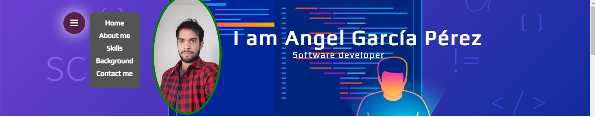
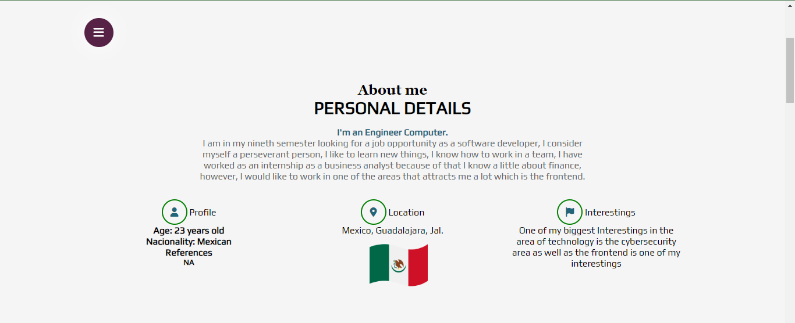
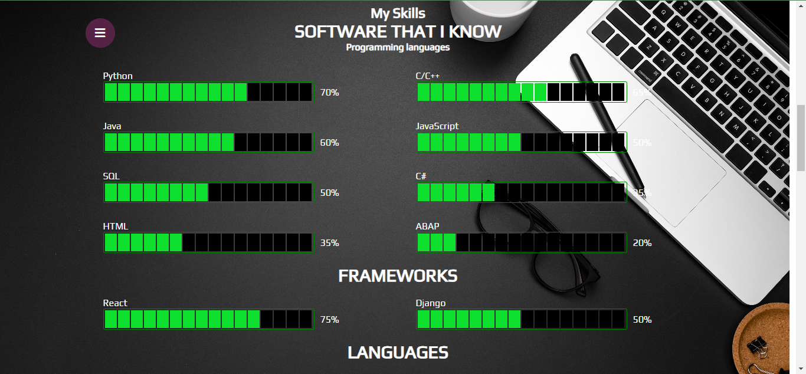
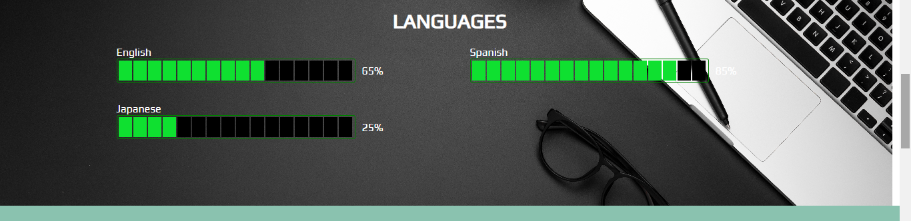
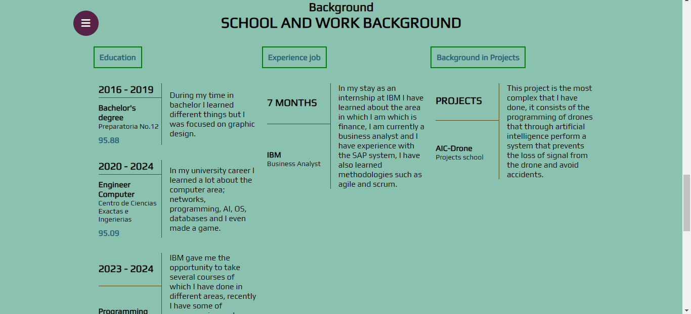
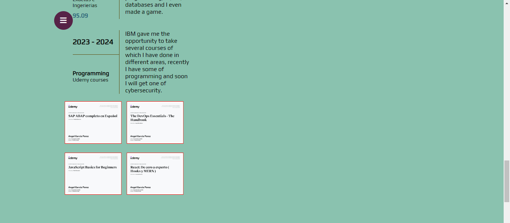
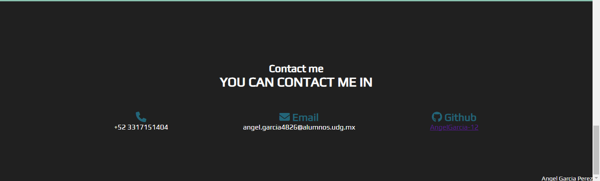

Creacion de mi Curriculum Vitae realizado con HTML, CSS y JavaScript.
Al cargar la pagina podemos ver que cuenta con un menu despegable en dondese muestra
cada uno de los apartados que abarca este CV. Tenemos las siguientes pestañas
- Home
- About me
- Skills
- Background
- Contact me

Donde en cada una de estas al dar click se dirige al respectivo apartado.
Apartado "Home".

Apartado "About me".

En este apartado se habla un poco sobre mi para que el lector pueda conocer acerca sobre mi.

Apartado "Skills"

En este apartado se muestra mi dominio sobre lenguajes de programacion, lenguajes y frameworks.

Apartado "Background"

En este apartado se explica un poco sobre mi expericiencia laboral y recorrido academico.

Apartado "Contact me"

En este apartado se explica la manera de contactarme.